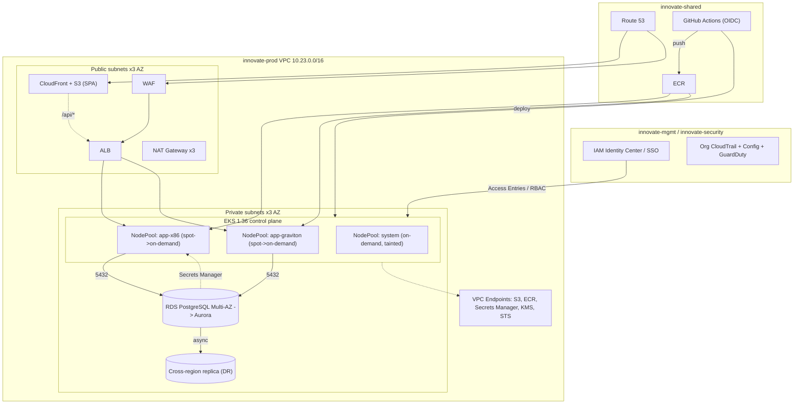
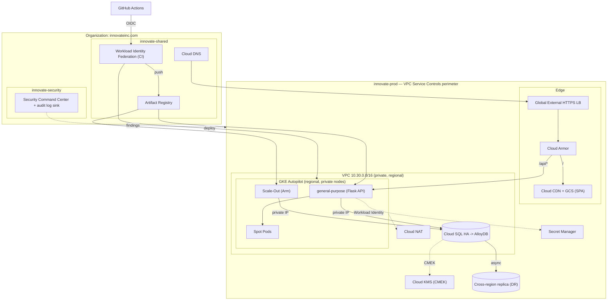

# Innovate Inc. — Cloud Architecture Design

**Client:** Innovate Inc. — small startup, limited cloud experience, Flask/React/PostgreSQL web app, hundreds of users today with a rapid-growth path to millions, sensitive user data, CI/CD required.

This document designs the platform **twice** — once on AWS, once on GCP — to the same depth, then closes with a side-by-side comparison and a recommendation. Both designs use managed Kubernetes and follow the same best-practice shape (isolated environments, private networking, managed database with HA/DR, CI/CD via container registry + Kubernetes deploy); they differ in which managed primitives do the work.

---

# Part A — AWS Design

## A.1 Cloud Environment Structure

**AWS Organizations**, one management account plus one account per environment/function:

| Account | Purpose |
|---|---|
| `innovate-mgmt` | Organizations root, IAM Identity Center (SSO), consolidated billing. No workloads. |
| `innovate-security` | GuardDuty/Security Hub/Config aggregator, org-wide CloudTrail, immutable log-archive S3 bucket (write-only from other accounts). |
| `innovate-shared` | ECR (shared image registry), Route 53 public hosted zone, CI/CD OIDC roles. |
| `innovate-dev` | Dev EKS cluster + RDS. Broad IAM access for engineers. |
| `innovate-staging` | Pre-prod, mirrors prod topology at smaller scale — load/DR testing, migration rehearsal. |
| `innovate-prod` | Production EKS cluster + RDS. Real traffic, real sensitive data. Access restricted to on-call + CI/CD role. |

**Why multi-account, not one account with multiple VPCs:** blast radius and billing. Accounts are the hardest isolation boundary AWS offers — no IAM policy or Terraform mistake in `dev` can reach prod's KMS keys, RDS snapshots, or S3 buckets, because there is no cross-account path unless explicitly granted. Billing is also naturally per-account, so a runaway dev resource doesn't distort the number that matters (prod spend).

**Why not finer-grained (per-service accounts):** at hundreds of users/day, splitting further is overhead without payoff. Six accounts is the minimum split that separates billing, security tooling, shared platform services, and blast radius per environment — everything Organizations is built for. More granularity is a cheap later step (new account, move workloads), not a redesign.

**Management:** IAM Identity Center federates human access — no IAM users, no long-lived access keys. Service Control Policies on `dev`/`staging` block risky/expensive actions (no `iam:CreateUser`, region lock). One Terraform root module per account, each with its own S3 state bucket + DynamoDB lock table — no shared state file across a trust boundary.

## A.2 Network Design

**VPC per environment**, 3 AZs, non-overlapping CIDRs (`10.21.0.0/16` dev, `10.22.0.0/16` staging, `10.23.0.0/16` prod) so cross-account peering/Transit Gateway later doesn't require renumbering.

| Tier | Contents |
|---|---|
| Public subnets ×3 AZ | ALB, NAT Gateway(s) only — no compute, no data |
| Private subnets ×3 AZ | EKS nodes, RDS subnet group |

- Dev: single NAT Gateway (cost-saving, no availability SLA). Staging/prod: one NAT Gateway per AZ — an AZ outage shouldn't take down egress for the other two.
- RDS never public; reachable only from the EKS node security group on `5432`.

**Network security:**
- Security Groups as the primary control: `alb-sg` (80/443 from internet) → `eks-node-sg` (app port from ALB only) → `rds-sg` (5432 from node SG only). No bastion, no direct developer DB access.
- EKS API endpoint's public access restricted to office/VPN CIDRs (`cluster_endpoint_public_access_cidrs`); private access always on so in-VPC/CI traffic stays off the public internet.
- No SSH — node access via SSM Session Manager only. IMDSv2 enforced on all nodes.
- **WAF** (AWS Managed Rules + rate-based rule) on the ALB.
- **VPC endpoints** (S3, ECR, Secrets Manager, KMS, STS) keep node→AWS-service traffic off the NAT Gateway entirely.
- VPC Flow Logs shipped to the security account. TLS via ACM on the ALB; RDS forces SSL.

## A.3 Compute Platform

**Amazon EKS**, control plane managed, private+public API endpoint, control-plane logging on, KMS-encrypted secrets at the etcd layer.

- **No managed node groups** — **Karpenter** owns 100% of node lifecycle, reacting to unschedulable pods in seconds instead of minutes on a fixed node-group size.
- **Access as code**: EKS Access Entries map IAM roles (from Identity Center) to Kubernetes RBAC — no `aws-auth` ConfigMap hand-editing, no shared kubeconfig, no static credentials.
- **Karpenter bootstraps via Fargate**: `kube-system` runs on a Fargate profile so Karpenter doesn't need an EC2 node to start.

**Node groups / scaling / resource allocation** — three Karpenter NodePools:

| NodePool | Capacity | Arch | Role |
|---|---|---|---|
| `system` | on-demand only | amd64 | Tainted, critical add-ons (CoreDNS, controllers) — never Spot-evicted |
| `app-x86` | spot → on-demand fallback | amd64 | General application workloads |
| `app-graviton` | spot → on-demand fallback | arm64 | Same workloads on Graviton — ~20% cheaper, deeper/more stable Spot pricing |

- HPA on CPU/memory (later: custom metrics) drives pod replica count; Karpenter provisions the cheapest matching instance for unschedulable pods.
- Spot interruption handled via SQS + EventBridge (2-minute drain notice) — requires `PodDisruptionBudget`s on Deployments to be safe.
- Every Deployment sets `requests`/`limits`; Karpenter's `WhenEmptyOrUnderutilized` consolidation continuously bin-packs and removes underused nodes — the real cost lever at scale.

**Containerization / build / registry / deploy:**
- Multi-stage Dockerfiles, multi-arch builds (`buildx --platform linux/amd64,linux/arm64`) to target both NodePools.
- **ECR**, one repo per service in the shared account; images promoted dev→staging→prod by re-tagging the same digest, never rebuilt.
- ECR image scanning (Inspector) gates the pipeline.
- CI/CD: GitHub Actions with OIDC (no long-lived AWS keys) → build → push → scan gate → deploy via Helm/kubectl against an Access-Entry-backed role; move to ArgoCD (GitOps) once release cadence/environment count make manual promotion error-prone.
- React SPA served from **S3 + CloudFront**, not run as pods — only the Flask API lives in EKS.

## A.4 Database

**RDS for PostgreSQL, Multi-AZ**, at launch → **Aurora PostgreSQL** at scale.

- RDS: fully managed patching/backup/failover, Multi-AZ synchronous standby (failover ~60–120s) — removes PostgreSQL ops entirely from a team with limited experience. Cheaper than Aurora below the traffic level where Aurora's per-I/O/minimum-instance pricing pays off.
- Aurora migration path (snapshot restore/DMS, near-zero downtime) once scale demands: up to 15 read replicas vs. RDS's 5, storage auto-scales to 128TB, optional Serverless v2 for spiky traffic.

**Backups/HA/DR:**
- Automated backups (7d dev, 35d prod max) + PITR to any second in that window; manual snapshot before every migration, cross-region copy for DR.
- `storage_encrypted` with a customer-managed KMS key, separate key per environment; `rds.force_ssl` in transit.
- Credentials in **Secrets Manager** with automatic rotation, read by the app via IRSA — no password in Terraform state or app config.
- HA: Multi-AZ standby → multiple cross-AZ read replicas (Aurora) as it matures.
- DR: promotable cross-region read replica (`us-west-2`) — RTO in the tens of minutes, RPO bounded by replication lag (seconds).
- Quarterly automated restore-and-verify job.

## A.5 AWS High-Level Diagram



---

# Part B — GCP Design

## B.1 Cloud Environment Structure

**GCP Resource Hierarchy** — Organization → Folders → Projects, IAM inherits down the tree:

```
Organization (innovateinc.com)
├── Folder: bootstrap      → Terraform state, org-level IAM
├── Folder: security       → Security Command Center, org log sink, KMS keyring
├── Folder: shared         → Artifact Registry, DNS, CI/CD Workload Identity pool
└── Folder: environments   → innovate-dev / innovate-staging / innovate-prod
```

| Project | Purpose |
|---|---|
| `innovate-bootstrap` | Terraform remote state (GCS + locking), org policy baseline. No workloads. |
| `innovate-security` | Security Command Center (Premium), centralized immutable audit-log sink, KMS keyring. |
| `innovate-shared` | Artifact Registry, Cloud DNS, Workload Identity Federation pool for CI. |
| `innovate-dev` | Dev GKE cluster + Cloud SQL. Broad IAM access for engineers. |
| `innovate-staging` | Pre-prod, mirrors prod topology at smaller scale. |
| `innovate-prod` | Production GKE cluster + Cloud SQL/AlloyDB. Restricted to on-call + CI/CD service account. |

**Why per-environment projects:** IAM bindings, quotas, and — importantly — a **VPC Service Controls** perimeter are project-scoped. Prod in its own project means a policy mistake in dev cannot reach prod's Cloud SQL or Secret Manager; the perimeter is a hard boundary, not convention. Billing is naturally per-project.

**Why not finer-grained:** same reasoning as AWS — at this traffic/team size, per-microservice projects are overhead without payoff; the folder hierarchy already supports splitting later without redesign.

**Management:** Google Workspace/Cloud Identity groups mapped to IAM roles at folder/project level — onboarding is a group-membership change, not a Terraform change. Org Policies enforced at the `environments` folder: no service-account-key creation, restricted external IPs, mandatory OS Login. No service account keys anywhere — humans use short-lived `gcloud auth` tokens, CI uses Workload Identity Federation.

## B.2 Network Design

**Shared VPC per environment**, non-overlapping CIDRs (`10.10.0.0/16` dev, `10.20.0.0/16` staging, `10.30.0.0/16` prod).

| Subnet | Contents |
|---|---|
| `gke-nodes` (private) | GKE nodes — no external IPs, egress via Cloud NAT |
| `gke-pods` / `gke-services` (secondary ranges, alias IP) | VPC-native pod/service IPs — no overlay network |
| `data` (private) | Cloud SQL private IP |

- **Regional GKE cluster** — control plane replicated across 3 zones by default (Autopilot), zero extra config for control-plane HA.
- **Private cluster**: nodes have no public IPs; control-plane endpoint restricted to authorized CIDRs (office/VPN + CI) via `master_authorized_networks`.
- **Cloud NAT** (regional, managed) for node egress — no per-AZ gateway to design individually.

**Network security:**
- VPC firewall rules: default-deny, explicit allow scoped by **service account or network tag** — e.g. only the `app-backend` SA's pods may reach `data:5432`. Ties network policy directly to workload identity rather than just IP/resource-ID matching.
- No bastion, no SSH — access via `gcloud`/`kubectl exec`, IAM-authenticated.
- **Cloud Armor** on the Global External HTTPS Load Balancer: OWASP managed rules, rate limiting, optional geo-fencing.
- **VPC Service Controls**: a service perimeter around `innovate-prod` covering Cloud SQL/AlloyDB, Secret Manager, Artifact Registry, GCS — blocks data exfiltration to a destination outside the perimeter even with a valid, leaked credential.
- **Private Google Access / Private Service Connect** for Cloud SQL, Secret Manager, Artifact Registry — traffic never touches the public internet.
- Managed TLS cert on the LB; Cloud SQL enforces `require_ssl`. Cloud Audit Logs shipped to the centralized security-project sink.

## B.3 Compute Platform

**GKE Autopilot** (not Standard):

- Google provisions, right-sizes, and patches every node — no node group to define, no AMI/patch cadence to own.
- Security hardening is default, not opt-in: Shielded Nodes, mandatory Workload Identity, non-root/no-privilege-escalation enforced by built-in admission policy.
- Billed per **pod resource request**, not per VM — a team's under/over-provisioning mistakes don't waste money on idle node capacity.

Trade-off: Autopilot restricts some low-level primitives (privileged DaemonSets, host networking). None are needed for this stack; a future workload that does need them (e.g. GPU-bound ML) would move to a scoped GKE Standard node pool, not require rebuilding the cluster.

**Compute classes / scaling / resource allocation** (Autopilot's equivalent of node groups, expressed per-pod via `nodeSelector`):

| Compute class | Use |
|---|---|
| `general-purpose` (default) | Flask API pods, on-demand x86 |
| Spot Pods | Stateless API replicas, background jobs — up to ~60–90% cheaper, 30s preemption notice |
| `Scale-Out` (Arm/Axion) | Arm-compatible backend images — Graviton-equivalent cost/perf story |

- Cluster-level scaling is automatic (no Cluster Autoscaler to configure). HPA on CPU/memory (later: custom metrics) drives pod count — the actual lever for hundreds→millions of users.
- Requests/limits are mandatory and **are** the billing unit in Autopilot — directly incentivizes correct sizing.
- Namespaces per service/environment; `ResourceQuota` once multiple teams ship to the cluster.

**Containerization / build / registry / deploy:**
- Multi-stage Dockerfiles, multi-arch builds for the Arm `Scale-Out` class.
- **Artifact Registry** (shared project), one repo per service; digest-based promotion dev→staging→prod.
- Built-in vulnerability scanning (on push + continuous re-scan) gates the pipeline.
- CI/CD: GitHub Actions authenticated via **Workload Identity Federation** — no exported service-account JSON keys ever. Build → push → scan gate → deploy (Helm/kubectl at first, Config Sync or ArgoCD for GitOps as release cadence grows).
- React SPA served from **Cloud Storage + Cloud CDN** behind the same Load Balancer — never runs as pods.

## B.4 Database

**Cloud SQL for PostgreSQL (HA)** at launch → **AlloyDB for PostgreSQL** at scale.

- Cloud SQL HA: regional synchronous standby, automatic failover (~<60s), private IP only. Fully managed patching/backup — no hand-rolled PostgreSQL replication.
- AlloyDB migration (Database Migration Service, near-zero downtime, wire-compatible — minimal app changes) once scale demands: columnar engine for analytics, higher sustained throughput, read pools that auto-scale independently of the primary — matches a rapid-growth curve better than adding Cloud SQL replicas one at a time.

**Backups/HA/DR:**
- Automated daily backups (retention up to 365 days) + PITR via WAL archiving; on-demand backup before every migration.
- **CMEK** (Cloud KMS) with a separate keyring per environment.
- Credentials in **Secret Manager** with rotation, read via Workload Identity (K8s SA → GCP SA scoped to that one secret).
- Private IP + Cloud SQL Auth Proxy (or IAM database auth) — no public IP ever.
- DR: promotable cross-region read replica — RTO in the tens of minutes, RPO bounded by replication lag (seconds).
- Quarterly automated restore-and-verify job.

## B.5 GCP High-Level Diagram



---

# Final Summary — AWS vs GCP

| Dimension | AWS (EKS + Karpenter) | GCP (GKE Autopilot) |
|---|---|---|
| **Node management** | Manual — Karpenter/node groups must be configured, sized, tuned | Fully automatic — Google provisions/patches nodes per-pod, nothing to design |
| **Security defaults** | Opt-in — node hardening, encryption, IRSA all explicit Terraform | Enforced by default — Shielded Nodes, mandatory Workload Identity, non-root pods |
| **Data-exfiltration control** | VPC endpoints + IAM, assembled manually, no perimeter primitive | **VPC Service Controls** — blocks exfiltration even with a leaked valid credential; no AWS equivalent |
| **Compute billing model** | Per EC2 instance regardless of bin-packing efficiency | Per pod resource request — sizing mistakes don't waste node capacity |
| **Org/account hierarchy** | Flat (Organization → Accounts) | Hierarchical (Organization → Folders → Projects), IAM inherits down |
| **Database ceiling** | Aurora — very mature, huge install base, 15 read replicas | AlloyDB — newer, strong OLTP benchmarks, read pools auto-scale |
| **Network edge** | ALB + separate CloudFront + separate WAF product | Global LB + CDN + Cloud Armor unified under one anycast frontend |
| **CI/CD auth** | OIDC → IAM role (no static keys) | Workload Identity Federation (no static keys) — parity |
| **Ecosystem / hiring pool** | Larger — more engineers with prior AWS experience, broader 3rd-party tool support (Datadog, PagerDuty first-class) | Smaller — fewer GCP-experienced hires available, thinner 3rd-party tooling |
| **Terraform module ecosystem** | Larger, more community modules, more prior art | Smaller, official `google` provider is solid but fewer community modules |
| **Learning curve for a team with limited cloud experience** | Higher — Karpenter, SGs+NACLs, node AMI/patch cadence are all explicit team responsibilities | Lower — Autopilot removes the node layer and most security config entirely |

### Verdict

Technically, **GCP/GKE Autopilot is the stronger fit for Innovate Inc. specifically because they state limited cloud experience.** Autopilot removes an entire category of operational responsibility (node provisioning, patching, security hardening) that EKS + Karpenter still requires the team to own, and VPC Service Controls is a materially stronger control for the "sensitive user data" requirement than anything AWS offers natively.

**AWS remains a legitimate, close second** — not because it's technically weaker for this workload, but because of organizational factors this document can't fully weigh: if Innovate Inc.'s founding/hiring plan leans toward engineers with existing AWS experience, or they anticipate needing AWS-specific services (e.g. a specific third-party SaaS integration that's AWS-only), that non-technical factor can reasonably outweigh GCP's operational-simplicity edge.

**Recommendation: GCP, GKE Autopilot, Cloud SQL → AlloyDB**, with the AWS design in Part A kept as a fully-specified fallback if the hiring/ecosystem factor tips the decision the other way.

---

## Note on Infrastructure as Code

Both designs are expressed as Terraform, following the same module discipline: per-environment root modules, remote state with locking, gitignored `tfvars`/`backend.hcl`, no secrets committed to git. Whichever provider is chosen, the module set is: `modules/vpc`, `modules/{eks|gke}`, `modules/{rds|cloudsql}`, plus a security/perimeter module (`modules/waf` for AWS, `modules/vpc-sc` for GCP), with `environments/{dev,staging,prod}` root modules composing them per environment.
