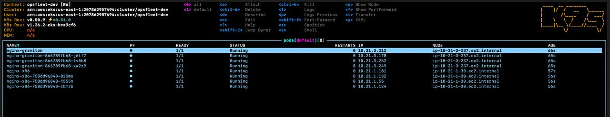
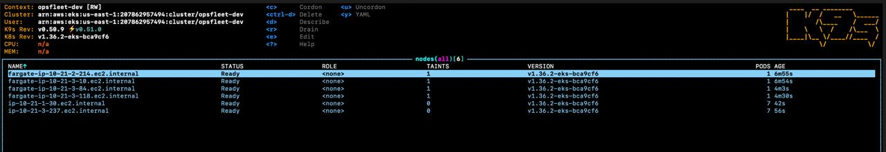

# EKS + Karpenter — Terraform Automation

Production-ready Terraform configuration to deploy an AWS EKS cluster with
[Karpenter](https://karpenter.sh) for node autoscaling, supporting **x86** and
**Graviton (arm64)** Spot instances with on-demand fallback.

## Architecture

```
┌─────────────────────────────────────────────────────────────────────┐
│  VPC (10.21.0.0/16)                                                │
│  ┌─────────────────────┐  ┌─────────────────────┐                  │
│  │  Public Subnets × 3  │  │  Private Subnets × 3 │                 │
│  │  (Load Balancers)    │  │  (EKS Nodes)         │                 │
│  └─────────────────────┘  └─────────────────────┘                  │
│                                    │                                │
│  ┌─────────────────────────────────▼───────────────────────────┐   │
│  │  EKS Cluster (v1.36)                                        │   │
│  │  ┌──────────────────────────────────────────────────────────┐│   │
│  │  │  Karpenter                                               ││   │
│  │  │                                                          ││   │
│  │  │  NodePools:                                              ││   │
│  │  │  ┌──────────┐  ┌──────────────────┐  ┌─────────────────┐ ││   │
│  │  │  │ system   │  │    app-x86       │  │  app-graviton   │ ││   │
│  │  │  │ on-demand│  │  spot + on-demand│  │ spot + on-demand│ ││   │
│  │  │  │  amd64   │  │     amd64        │  │     arm64       │ ││   │
│  │  │  └──────────┘  └──────────────────┘  └─────────────────┘ ││   │
│  │  └──────────────────────────────────────────────────────────┘│   │
│  └─────────────────────────────────────────────────────────────┘   │
└─────────────────────────────────────────────────────────────────────┘
```

### Node Pool Design

| NodePool | Architecture | Capacity | Instance Families | Purpose |
|----------|-------------|----------|-------------------|---------|
| `system` | amd64 | **on-demand** | t3, m5, c5 | Critical infra (CoreDNS, Karpenter) — tainted |
| `app-x86` | amd64 | **spot** → on-demand | t3, c5, c6i, m5, m6i, r5, r6i | General x86 applications |
| `app-graviton` | arm64 | **spot** → on-demand | t4g, c7g, m7g, r7g, c6g, m6g, r6g | ARM-compatible (Graviton) |

- **`system`** uses taints (`CriticalAddonsOnly:NoSchedule`) so only pods with
  matching tolerations land there. Karpenter runs on Fargate at bootstrap.
- **`app-x86`** and **`app-graviton`** use Spot by default with automatic
  on-demand fallback when Spot capacity is unavailable.
- Karpenter handles Spot interruption gracefully via the SQS + EventBridge integration.

## Directory Structure

```
terraform/
├── README.md
├── .gitignore
├── modules/
│   ├── vpc/              # VPC: subnets, NAT, EKS + Karpenter tags
│   ├── eks/              # EKS cluster, OIDC, IRSA, access entries, Fargate profile
│   └── karpenter/        # Helm release, NodePools, EC2NodeClasses
├── environments/
│   └── dev/              # Live deployment (root module) — region is a var
│       ├── main.tf                  # Module composition
│       ├── providers.tf             # AWS + Kubernetes + Helm + kubectl providers
│       ├── variables.tf
│       ├── outputs.tf
│       ├── terraform.tfvars.example # copy to terraform.tfvars (gitignored) and edit
│       └── backend.hcl.example      # copy to backend.hcl (gitignored) and edit
└── examples/
    ├── pod-x86.yaml       # Pod + Deployment targeting amd64
    └── pod-graviton.yaml  # Pod + Deployment targeting arm64
```

> Environment (`environments/<env>/`) and region (`var.aws_region` inside
> each environment) are separate axes, so `dev`/`staging`/`prod` can each
> target any region — or several, by adding more root modules under the
> same environment directory — without restructuring.

## Prerequisites

- **AWS CLI** — configured with credentials (`aws configure`)
- **Terraform** >= 1.5
- **kubectl** — for verifying the cluster
- **S3 bucket + DynamoDB** — for remote state (see [Backend](#backend))

Required IAM permissions for the deploying principal:
```
ec2:*, eks:*, iam:*, s3:*, dynamodb:*, sqs:*, events:*, pricing:*
```

## Quick Start

### 1. Clone & configure

```bash
cd terraform/environments/dev
cp terraform.tfvars.example terraform.tfvars
```

Edit `terraform.tfvars` (gitignored — never commit real values):
```hcl
cluster_name    = "opsfleet-dev"     # your cluster name
cluster_version = "1.36"             # latest EKS version
environment     = "dev"

# Restrict to your office/VPN CIDR — do not ship 0.0.0.0/0
public_access_cidrs = ["203.0.113.0/24"]
```

### 2. Configure backend

```bash
cp backend.hcl.example backend.hcl
```

Edit `backend.hcl` (gitignored) with your bucket and DynamoDB table:
```hcl
bucket         = "your-tfstate-bucket"
key            = "us-east-1/terraform.tfstate"
region         = "us-east-1"
dynamodb_table = "your-lock-table"
encrypt        = true
```

The `backend "s3" {}` block in `providers.tf` is intentionally empty — no
account-specific values are tracked in git. Local state for a quick,
throwaway test: `terraform init -backend=false`.

### 3. Bootstrap S3 backend

Bootstrap is handled by the wrapper script in the deploy step. It
creates/updates the S3 backend first and generates
`environments/dev/backend.hcl` from bootstrap outputs when needed.

### 4. Deploy

`run.sh --apply` is intentionally staged internally:

1. bootstrap backend
2. VPC + EKS
3. Karpenter Helm release + NodePools

That keeps the user-facing flow as one command while avoiding the
Kubernetes/Helm provider problem where the EKS API endpoint does not exist
yet during the first full plan.

After a successful dev apply, the script also adds/updates a kubectl context
named after the cluster, for example `opsfleet-dev`.

```bash
AWS_PROFILE=(your_profile) terraform/scripts/run.sh --apply
```

Approximate deploy time: 15–20 minutes.

### 5. Configure kubectl

```bash
aws eks update-kubeconfig --region us-east-1 --name opsfleet-dev
kubectl get nodes -o wide
```

Karpenter will provision a `system` node within ~2 minutes.

## Access Management

Cluster access is granted through **EKS Access Entries**
(`authentication_mode = "API"`, no aws-auth ConfigMap) — access is code,
reviewable in a PR, not a manual `kubectl edit configmap aws-auth`.

- The IAM principal that runs `terraform apply` gets admin automatically
  (`enable_cluster_creator_admin_permissions = true`).
- Everyone else — developers, CI — gets an entry in `access_entries`
  (`terraform.tfvars`), mapping their IAM role to an EKS access policy:

```hcl
access_entries = {
  developer = {
    principal_arn = "arn:aws:iam::123456789012:role/developer-role"
    policy_associations = {
      view = {
        policy_arn   = "arn:aws:eks::aws:cluster-access-policy/AmazonEKSViewPolicy"
        access_scope = { type = "namespace", namespaces = ["default"] }
      }
    }
  }
}
```

A developer then fetches short-lived cluster credentials by assuming that
IAM role — no shared kubeconfig files, no static AWS keys, no long-lived
tokens:

```bash
aws sts assume-role --role-arn arn:aws:iam::123456789012:role/developer-role \
  --role-session-name dev-session   # or `aws sso login` if using IAM Identity Center

aws eks update-kubeconfig --name opsfleet-dev --region us-east-1 \
  --role-arn arn:aws:iam::123456789012:role/developer-role

kubectl get pods
```

`update-kubeconfig` writes an `exec`-based kubeconfig entry that calls
`aws eks get-token` on every request — the same mechanism this repo's own
`kubernetes`/`helm`/`kubectl` Terraform providers use (`providers.tf`). No
bearer token or cert ever touches disk long-term.

For broader access (e.g. platform-team admins), use
`AmazonEKSAdminPolicy`/`AmazonEKSClusterAdminPolicy` with `access_scope.type
= "cluster"` instead of a namespaced `AmazonEKSViewPolicy`.

## Developer Guide: Running Pods

### Scheduling on x86 Instances

Add `nodeSelector` to your pod spec:

```yaml
spec:
  nodeSelector:
    kubernetes.io/arch: amd64
```

Example from `examples/pod-x86.yaml`:
```bash
kubectl apply -f ../../examples/pod-x86.yaml
kubectl get pods -o wide
```

### Scheduling on Graviton (arm64) Instances

Same pattern, but target `arm64`:

```yaml
spec:
  nodeSelector:
    kubernetes.io/arch: arm64
```

> **Important:** Your container image MUST support `arm64` architecture.
> Verify with: `docker buildx imagetools inspect <image> | grep arm64`

Example from `examples/pod-graviton.yaml`:
```bash
kubectl apply -f ../../examples/pod-graviton.yaml
kubectl get pods -o wide
```

### Example output

Pods scheduled by the x86 and Graviton examples:



Nodes provisioned by Karpenter for those pods:



### How scheduling works

1. You create a Pod with `nodeSelector: kubernetes.io/arch: amd64|arm64`
2. Karpenter watches for pending pods that don't fit on existing nodes
3. Karpenter matches the pod constraints to a **NodePool**:
   - `arch: amd64` → `app-x86` NodePool
   - `arch: arm64` → `app-graviton` NodePool
4. Karpenter selects the cheapest instance type from the allowed families,
   preferring Spot, falling back to on-demand if Spot is unavailable
5. A new node joins the cluster (~60s) and the pod is scheduled

### Advanced: targeting specific instance types

For workloads with specific needs (GPU, high memory, compute-optimized):

```yaml
spec:
  nodeSelector:
    kubernetes.io/arch: amd64
    node.kubernetes.io/instance-type: c6i.xlarge  # compute-optimized x86
```

Or add a Karpenter-specific label:
```yaml
spec:
  nodeSelector:
    karpenter.sh/nodepool: app-graviton  # target a specific NodePool by name
```

## Backend

Remote state is stored in S3 with DynamoDB locking. `providers.tf` declares
an empty `backend "s3" {}` — real values come from a gitignored
`backend.hcl` (see [Quick Start](#2-configure-backend)), so no
account-specific config is tracked in git.

For additional environments or regions, add a directory under `environments/`
(e.g., `environments/staging/`, or `environments/dev-eu-west-1/`) with the
same module structure, each with its own `backend.hcl` / `terraform.tfvars`.

## Cleanup

```bash
AWS_PROFILE=(your_profile) terraform/scripts/destroy.sh --apply
```

`destroy.sh --apply` destroys the dev environment before bootstrap. Inside
dev it first destroys `module.karpenter` while the EKS API is still available,
then destroys the remaining EKS/VPC resources. This avoids the kubectl
provider falling back to `http://localhost` during a single full destroy.
After a successful dev destroy, the script removes the matching kubectl
context.

## Verification

After deployment, verify the setup:

```bash
# Nodes — check architecture and capacity type
kubectl get nodes -o custom-columns=\
NAME:.metadata.name,\
ARCH:.metadata.labels.kubernetes\\.io/arch,\
TYPE:.metadata.labels.karpenter\\.sh/capacity-type,\
NODEPOOL:.metadata.labels.karpenter\\.sh/nodepool

# Karpenter logs
kubectl logs -n kube-system deployment/karpenter -f

# NodePools
kubectl get nodepools

# EC2NodeClasses
kubectl get ec2nodeclasses
```
